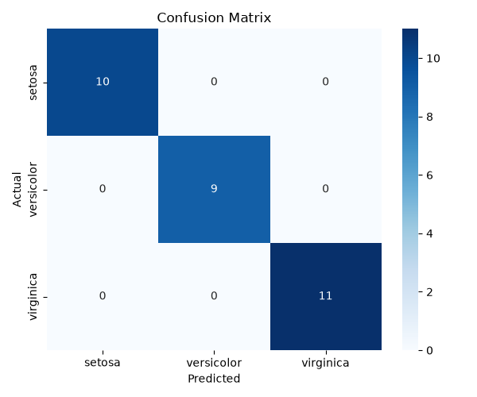

# 🌸 Iris Classifier 2.0

<p align="center">


</p>

---

## 📖 Overview

This repository demonstrates a complete **end-to-end supervised machine learning workflow** using the classic **Iris flower dataset** and **scikit-learn**.

The project walks through every major stage of a machine learning pipeline:

- 📥 Loading data
- 🔍 Exploring the dataset
- ✂️ Train/Test split
- 🌳 Training a Decision Tree Classifier
- 🎯 Making predictions
- 📈 Evaluating model performance
- 💾 Saving the trained model
- 📊 Visualizing results using a confusion matrix

This project was completed as part of the **AI Fundamentals** course.

---

# 🎯 Problem Statement

Given four measurements of an Iris flower:

- Sepal Length
- Sepal Width
- Petal Length
- Petal Width

predict which species the flower belongs to:

🌸 Setosa

🌿 Versicolor

🌺 Virginica

This is a **multi-class classification problem**.

---

# 📂 Project Structure

```text
iris-classifier-2.0
│
├── data/
│
├── notebooks/
│   └── iris_model.ipynb
│
├── outputs/
│   ├── confusion_matrix.png
│   └── model.joblib
│
├── src/
│   └── train.py
│
├── tests/
│   └── test_train.py
│
├── requirements.txt
├── README.md
├── LICENSE
└── .gitignore
```

---

# ⚙️ Technologies Used

| Technology | Purpose |
|------------|---------|
| Python | Programming Language |
| Scikit-learn | Machine Learning |
| Matplotlib | Visualization |
| Seaborn | Confusion Matrix |
| Joblib | Model Serialization |
| Jupyter Notebook | Experimentation |
| Pytest | Unit Testing |

---

# 🔄 Machine Learning Workflow

```text
Load Dataset
      │
      ▼
Explore Data
      │
      ▼
Train/Test Split
      │
      ▼
Train Decision Tree
      │
      ▼
Predict Test Data
      │
      ▼
Evaluate Accuracy
      │
      ▼
Generate Confusion Matrix
      │
      ▼
Save Trained Model
```

---

# 🚀 Installation

Clone the repository

```bash
git clone https://github.com/midnighttalehouse-star/iris-classifier-2.0.git
cd iris-classifier-2.0
```

Create a virtual environment

```bash
python -m venv venv
```

Activate

### Windows

```bash
venv\Scripts\activate
```

### Linux / macOS

```bash
source venv/bin/activate
```

Install dependencies

```bash
pip install -r requirements.txt
```

---

# ▶️ Run the Project

Default run

```bash
python src/train.py
```

or

```bash
python src/train.py --test-size 0.2 --random-state 42
```

---

# 📊 Results

Example output

```text
Accuracy: 1.0000

Confusion matrix saved to:
outputs/confusion_matrix.png

Model saved to:
outputs/model.joblib
```

---

# 📈 Confusion Matrix

The generated confusion matrix is automatically saved inside **outputs/**.

<p align="center">



</p>

---

# 💾 Generated Files

Running the training script creates:

```
outputs/
├── confusion_matrix.png
└── model.joblib
```

---

# 🧪 Running Tests

```bash
pytest
```

Expected output

```text
1 passed
```

---

# 📚 Key Learning Outcomes

✅ Data preprocessing

✅ Train/Test splitting

✅ Decision Tree Classification

✅ Model evaluation

✅ Accuracy metrics

✅ Confusion Matrix

✅ Saving trained models

✅ Basic software testing

---

# 📄 License

This project is licensed under the **MIT License**.

---

# 👨‍💻 Author

**Saddam Hussain**

AI & Machine Learning Enthusiast

GitHub

https://github.com/midnighttalehouse-star